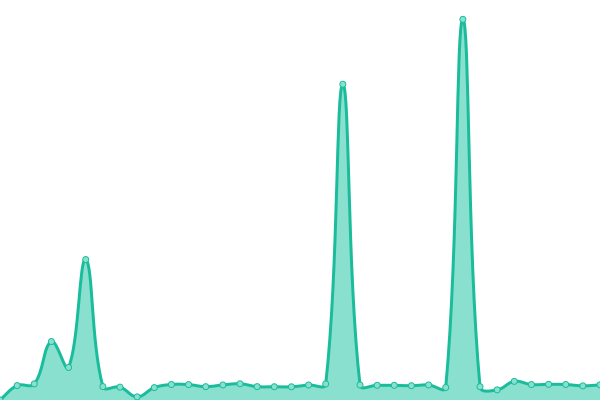

# [📈 Live Status](https://demo.upptime.js.org): <!--live status--> **🟩 All systems operational**

<!--start: status pages-->
<!-- This summary is generated by Upptime (https://github.com/upptime/upptime) -->
<!-- Do not edit this manually, your changes will be overwritten -->
<!-- prettier-ignore -->
| URL | Status | History | Response Time | Uptime |
| --- | ------ | ------- | ------------- | ------ |
|  [API](https://uhmyp.ftclouds.asia) | 🟩 Up | [api.yml](https://github.com/AutoFTbot/Server-FT/commits/HEAD/history/api.yml) | 

 843ms
     
 | 

<a href="https://Serverft.my.id/history/api">100.00%</a>
    

|  [SG 1](https://uhmyp.ftclouds.asia) | 🟩 Up | [sg-1.yml](https://github.com/AutoFTbot/Server-FT/commits/HEAD/history/sg-1.yml) | 

 202ms
     
 | 

<a href="https://Serverft.my.id/history/sg-1">100.00%</a>
    

|  [Google DNS](dns.google) | 🟩 Up | [google-dns.yml](https://github.com/AutoFTbot/Server-FT/commits/HEAD/history/google-dns.yml) | 

 3ms
     
 | 

<a href="https://Serverft.my.id/history/google-dns">100.00%</a>
    

|  [BIZNET RIZKYVPN](https://f8su5v.x-project-vpn.com) | 🟩 Up | [biznet-rizkyvpn.yml](https://github.com/AutoFTbot/Server-FT/commits/HEAD/history/biznet-rizkyvpn.yml) | 

 2399ms
     
 | 

<a href="https://Serverft.my.id/history/biznet-rizkyvpn">97.95%</a>
    

<!--end: status pages-->
